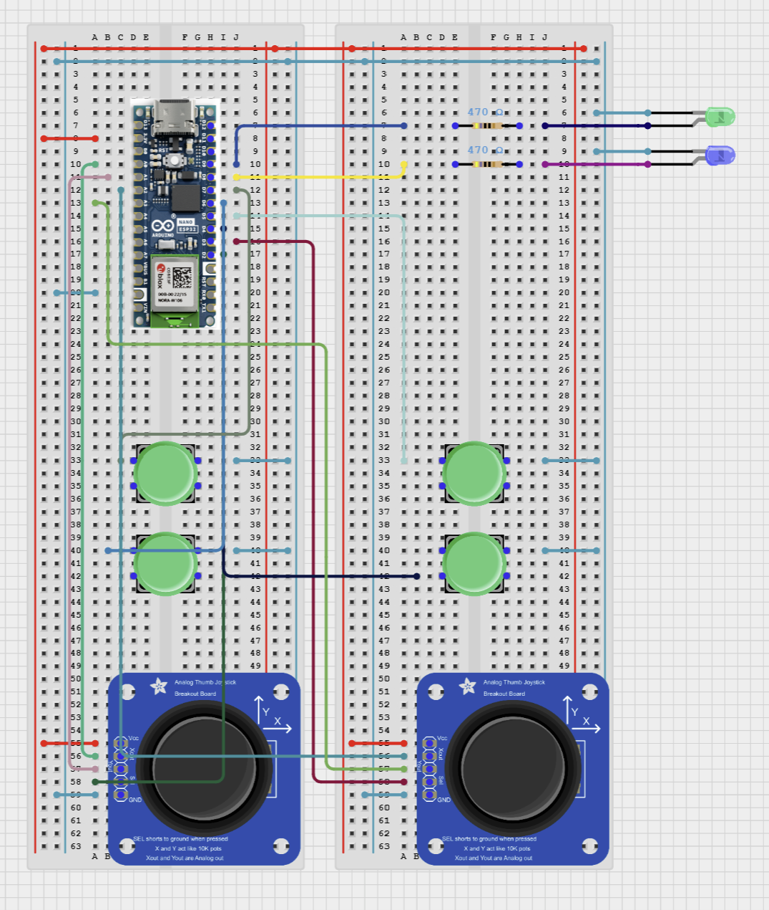
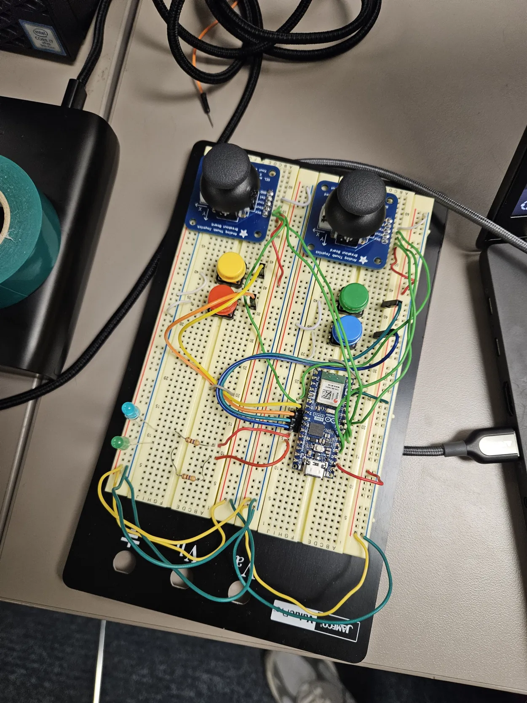
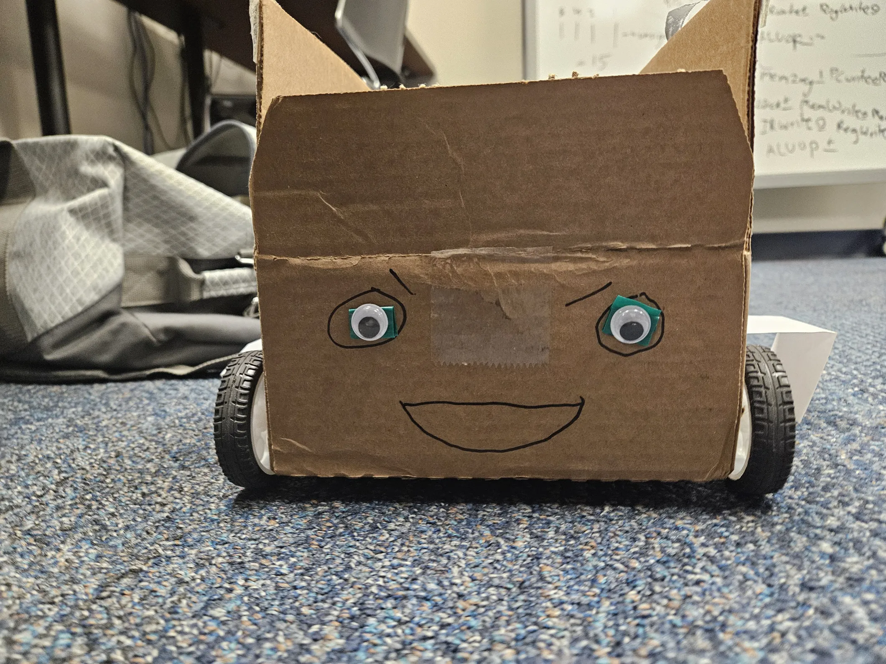
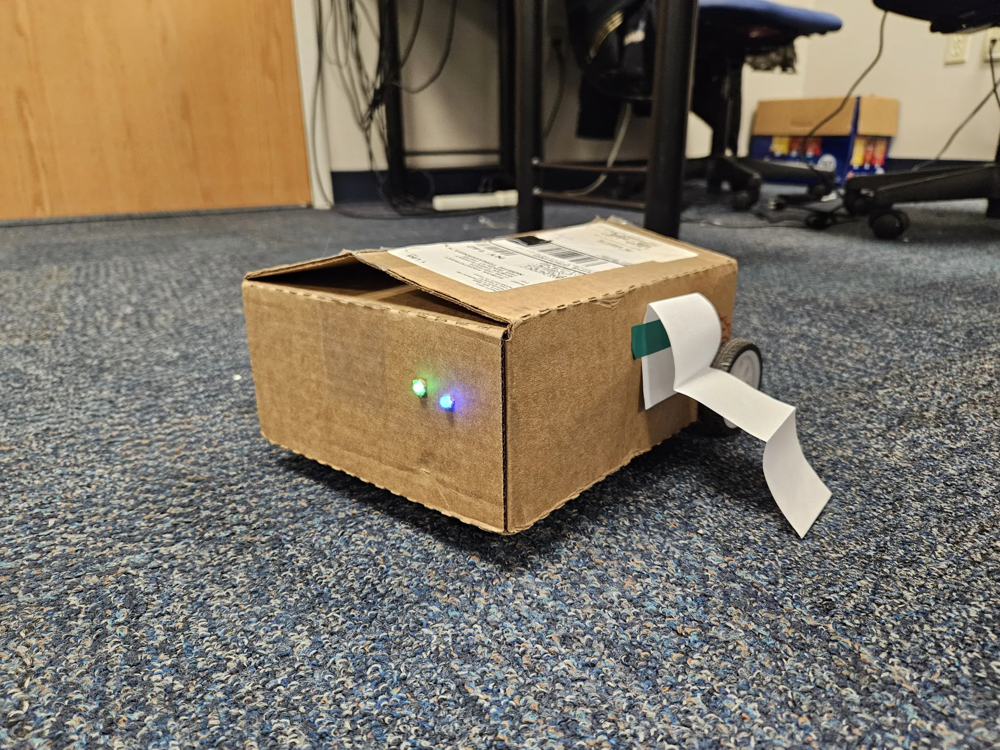

# D.U.C.K.S Robot

The Drivable User-Controlled Kinematics System (DUCKS) is a robot that can be controlled in real time using a controller using Bluetooth Low Energy!

The Bluetooth pairing code uses a hardcoded address to pair only with the correct device. You can make a simple sketch to identify what the Bluetooth address of the robot microcontroller is and then hardcode that into the `CENTRAL_ADDRESS` variable in the controller code. Once both devices are powered and turned on, they will pair automatically. When each device detects that it has paired, it will  light up its blue LED indicator.

Once both devices have been paired, the left joystick's Y-axis will control the direction and velocity of the left wheel on the robot and the right joystick's Y-axis will control the direction and velocity of the right wheel.

## Controller

The controller was designed using an Arduino Nano ESP32, two joysticks, and four push buttons.Once the controller pairs with the host device, it will automatically send data packets to the controller every time new inputs are detected over Bluetooth Low Energy. 

## Robot

The robot has an Arduino Giga on board as well as two TT gearbox motors and an H-bridge circuit. The microcontroller receives commands from th controller and controls the motors accordingly to have the robot move through space. 

